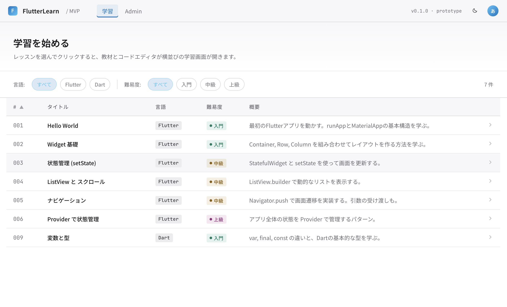

# flutter-learning-app

Flutterを実践的に学習するためのWebベース学習プラットフォームです。

教材の閲覧、コード編集、実行結果の確認、ビルドログの確認、LLMへの質問を1つのWebアプリ上で行える環境を目指します。

- [docs 目次](docs/README.md)
- [プロダクト概要](docs/product/01_プロダクト概要.md)
- [機能要件](docs/requirements/01_機能要件.md)
- [非機能要件](docs/requirements/02_非機能要件.md)
- [開発計画](docs/project/01_開発計画.md)

## MVP方針

MVPでは、Flutter教材に特化した学習体験を検証します。

- テンプレート差し替え方式ではなく、サーバービルド方式を採用する
- 第一段階では、フロントエンド、バックエンド、データベース、ビルド環境をローカルDocker上で動作させる
- 第二段階では、GCPやAWSなどのクラウド上でビルド用ワークスペースまたはコンテナを生成する
- 編集対象ファイルは限定せず、プロジェクト全体を編集対象にする
- コードはブラウザ上に保存し、プロジェクト全体のダウンロード・アップロードに対応する
- 破壊的な変更に備え、ファイル単位またはプロジェクト単位で初期状態へリセットできるようにする
- 管理者向け画面で教材の手動追加・編集、LLMによるロードマップ・教材下書き生成、公開状態管理を扱う

LLM教材生成では、個別教材を直接作るのではなく、到達目標と成果物を定義し、ロードマップを細かいステップに分割してから、各ステップの教材を生成します。

## 完成画面想定図

### S01 教材一覧画面


### S02 学習メイン画面 (コードエディタ + 教材閲覧)
.png)

### S02 学習メイン画面 (コードエディタ + LLMチャット)
.png)

### S03 管理者向け画面 (教材一覧)
.png)

### S03 管理者向け画面 (教材編集)
.png)

## 想定ディレクトリ構成

```text
.
├── README.md
├── docs/
│   ├── README.md
│   ├── product/
│   │   ├── README.md
│   │   ├── 01_プロダクト概要.md
│   │   ├── 02_MVPスコープ.md
│   │   └── 03_ロードマップ.md
│   ├── requirements/
│   │   ├── README.md
│   │   ├── 01_機能要件.md
│   │   └── 02_非機能要件.md
│   ├── research/
│   │   ├── README.md
│   │   ├── 01_Progate型学習環境の調査.md
│   │   ├── 02_Flutterオンライン実行方式.md
│   │   └── 03_AI教材生成の調査.md
│   ├── technology/
│   │   ├── README.md
│   │   ├── 01_技術選定.md
│   │   ├── 02_セキュリティ方針.md
│   │   ├── 03_API設計.md
│   │   ├── 04_DB設計.md
│   │   ├── 05_フロントエンド.md
│   │   ├── 06_バックエンド.md
│   │   ├── 07_実行環境.md
│   │   └── 08_LLM連携.md
│   ├── architecture/
│   │   ├── README.md
│   │   ├── 01_システムアーキテクチャ.md
│   │   ├── 02_教材管理アーキテクチャ.md
│   │   ├── 03_実行環境アーキテクチャ.md
│   │   ├── 04_Admin承認フロー.md
│   │   └── 05_多言語対応方針.md
│   ├── design/
│   │   ├── README.md
│   │   ├── 01_画面一覧.md
│   │   ├── 02_画面設計.md
│   │   └── 03_UI方針.md
│   ├── project/
│   │   ├── README.md
│   │   ├── 01_開発計画.md
│   │   ├── 02_マイルストーン.md
│   │   └── 03_GitHubプロジェクト管理.md
│   ├── references/
│   │   ├── README.md
│   │   └── 01_Claude関連のURL.md
│   └── images/
├── claude-docs/
│   ├── README.md
│   └── claude-document-rules.md
├── contents/
│   └── flutter/
│       └── practical-flutter/
│           └── lesson-001/
│               ├── lesson.md
│               ├── metadata.json
│               ├── initial_project/
│               └── solution_project/
├── apps/
│   ├── web/
│   └── api/
└── packages/
```

## 現在の優先事項

1. MVP第一段階として、ローカルDocker上で学習体験を成立させる
2. 複数ファイル編集、ブラウザ保存、ダウンロード・アップロード、初期状態リセットを実装する
3. サーバービルド方式でFlutter Webのビルドとプレビューを検証する
4. 管理者向け画面で教材追加・編集、LLMロードマップ・教材生成を検証する
5. MVP第二段階として、クラウド上のワークスペース生成方式を設計する

## ライセンス

未定
