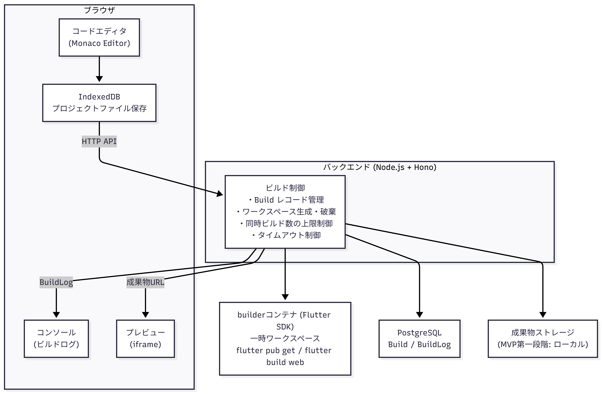
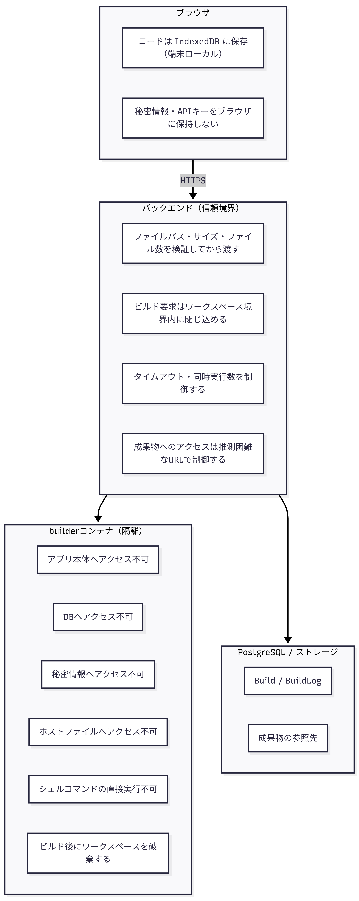

# 実行環境アーキテクチャ

## 1. 概要

実行環境コンテキストは、学習者がブラウザ上で編集したFlutterコードをサーバー側でビルドし、プレビューとして返すまでの一連の流れを管理する境界づけられたコンテキストである。

サーバービルド方式を採用する理由は次の通りである。

- 実務に近い複数ファイル構成（Widget分割、状態管理、ルーティング等）を扱える
- ブラウザ内だけでの実行では対応できない依存関係・アセット・設定ファイルを扱える
- 将来的にFlutter以外の言語・フレームワークへ拡張しやすい

MVP第一段階ではローカルDocker上のbuilderコンテナでビルドを実行する。MVP第二段階ではクラウド上の一時コンテナへ移行する。

---

## 2. コンポーネント構成



### 主要コンポーネント

| コンポーネント | 役割 |
|-------------|------|
| フロントエンド (Next.js) | コードエディタ・ビルド要求・ログ表示・プレビュー表示 |
| IndexedDB | 学習者のプロジェクトファイルをブラウザ上に保存 |
| バックエンド (Hono) | ビルド要求の受付・ワークスペース管理・状態管理 |
| builderコンテナ | Flutter SDK を含む隔離されたビルド実行環境 |
| PostgreSQL | Build・BuildLog レコードの永続化 |
| 成果物ストレージ | Flutter Web ビルド成果物の保存 |

### Buildの主要属性

| 属性 | 説明 |
|------|------|
| `id` | ビルドID |
| `lessonId` | 対象の教材ID |
| `inputRef` | ビルド時のプロジェクトスナップショットの参照先 |
| `status` | `queued` / `running` / `succeeded` / `failed` / `timeout` / `cancelled` |
| `startedAt` | ビルド開始日時 |
| `finishedAt` | ビルド完了日時 |
| `previewUrl` | 成果物のプレビューURL |
| `artifactRef` | 成果物の保存先参照 |

### BuildLogの主要属性

| 属性 | 説明 |
|------|------|
| `buildId` | 対応するビルドID |
| `type` | `stdout` / `stderr` / `system` |
| `content` | ログ内容 |
| `createdAt` | ログ出力日時 |

---

## 3. ビルド実行の流れ

### 3.1 ビルドステータス遷移

```
           ┌─────────────────────────────────────┐
           │            同時実行数が上限の場合       │
           │            → 待機または拒否           │
           ▼                                     │
[queued] ──┘─────────────────────────▶ [running]
                                           │
                          ┌────────────────┼────────────────┐
                          ▼                ▼                ▼
                    [succeeded]        [failed]         [timeout]
                                                            │
                                                      [cancelled]
```

### 3.2 ビルド要求から完了まで

#### ステップ1: プロジェクトファイルの準備

```
学習者がコードを編集
  │ Monaco Editor で編集
  ▼
IndexedDB に自動保存
  │ プロジェクトファイル一式を保持
  │ { "lib/main.dart": "...", "pubspec.yaml": "...", ... }
  ▼
学習者が [ビルド実行] ボタンを押す
  │ IndexedDB からプロジェクトファイル一式を読み込む
  ▼
POST /api/builds
  {
    lessonId: "lesson_001",
    files: [
      { path: "lib/main.dart", content: "..." },
      { path: "pubspec.yaml", content: "..." }
    ],
    buildConfig: { target: "web" }
  }
```

#### ステップ2: ビルド要求の受付

```
backend
  │ 同時実行数を確認
  │   上限以内 → 続行
  │   上限超過  → 待機状態にするか、ユーザーに再実行を促す
  │
  │ Build レコードを作成 (status: queued)
  │ inputRef にプロジェクトスナップショットを保存
  ▼
{ buildId: "build_001", status: "queued" } を即時返却
  │
  ▼
ブラウザ側でポーリング開始 (または SSE 接続)
  GET /api/builds/:buildId
```

#### ステップ3: ワークスペース生成

```
backend
  │ Build.status → running
  │
  │ builderコンテナ内に一時ワークスペースを生成
  │   /workspace/{buildId}/
  │
  │ 教材の初期プロジェクト (initialProjectRef) をワークスペースに展開
  │   ベースとなるFlutterプロジェクト構成・依存関係の初期状態を配置
  │
  │ 学習者が編集したファイルをワークスペースに上書き反映
  │   { path, content } の一覧を順次書き込む
  ▼
ワークスペース準備完了
  /workspace/{buildId}/
    ├── lib/
    │   └── main.dart        ← 学習者が編集したファイル
    ├── pubspec.yaml          ← 学習者が編集したファイル
    ├── pubspec.lock          ← 初期プロジェクトから引き継ぎ
    └── ...
```

#### ステップ4: Flutter Webビルドの実行

```
builderコンテナ (ワークスペース内)
  │
  │ flutter pub get
  │   → 依存関係を解決
  │   → stdout / stderr を BuildLog として保存 (type: stdout / stderr)
  │
  │ flutter build web
  │   → Flutter Web 成果物を生成
  │   → stdout / stderr を BuildLog として保存 (type: stdout / stderr)
  ▼
ビルド完了 (成功 or 失敗)
```

#### ステップ5: ビルド結果の処理

```
backend
  │
  ├── [ビルド成功]
  │     │ 成果物 (build/web/) を成果物ストレージへ移動
  │     │ Build.artifactRef に保存先パスを記録
  │     │ Build.previewUrl に参照 URL を設定
  │     │ Build.status → succeeded
  │     │ Build.finishedAt を記録
  │     │ ワークスペースを破棄
  │     ▼
  │   { status: "succeeded", previewUrl: "..." }
  │
  └── [ビルド失敗 / タイムアウト]
        │ BuildLog に system ログとしてエラー種別を記録
        │ Build.status → failed / timeout
        │ Build.finishedAt を記録
        │ ワークスペースを破棄
        ▼
      { status: "failed", ... }
```

#### ステップ6: プレビューとログの表示

```
ブラウザ
  │
  │ GET /api/builds/:buildId  (ポーリング or SSE)
  │   → status が終端状態 (succeeded / failed / timeout) になるまで監視
  │   → ビルド中はコンソールに「ビルド中...」を表示
  │
  ├── [succeeded]
  │     GET /api/builds/:buildId/artifacts
  │       → 成果物の参照先を取得
  │       → iframe の src に設定してプレビュー表示
  │     GET /api/builds/:buildId/logs
  │       → BuildLog 一覧を取得してコンソールに表示
  │
  └── [failed / timeout]
        GET /api/builds/:buildId/logs
          → エラーログをコンソールに表示
          → 学習者が原因を確認できる粒度で表示
          (内部実装・秘密情報は含めない)
```

---

## 4. データフロー

### 4.1 ビルド要求

```
ブラウザ (IndexedDB)
  │
  │ POST /api/builds
  │   { lessonId, files: [{path, content}], buildConfig }
  ▼
backend
  │ Build レコード作成 (status: queued)
  │   inputRef にプロジェクトスナップショット保存
  ▼
{ buildId, status: "queued" }
```

### 4.2 ワークスペース生成とビルド実行

```
backend
  │ Build.status → running
  │ 一時ワークスペース生成
  │ 教材の initialProject を展開
  │ 学習者ファイルを上書き
  ▼
builderコンテナ
  │ flutter pub get  → BuildLog (stdout/stderr)
  │ flutter build web → BuildLog (stdout/stderr)
  ▼
backend
  │ 成果物をストレージへ保存
  │ Build.status → succeeded / failed / timeout
  │ Build.previewUrl / artifactRef を記録
  │ ワークスペースを破棄
```

### 4.3 ログ・プレビューの取得

```
ブラウザ
  │
  │ GET /api/builds/:buildId          (状態監視)
  │ GET /api/builds/:buildId/logs     (BuildLog 一覧)
  │ GET /api/builds/:buildId/artifacts (成果物参照先)
  ▼
backend
  │ PostgreSQL から Build / BuildLog を取得
  │ 成果物ストレージから参照先を返す
  ▼
ブラウザ
  コンソール: BuildLog を表示
  プレビュー: iframe で成果物を表示
```

---

## 5. セキュリティ境界



### 同時実行制御

| 項目 | MVP第一段階 | MVP第二段階 |
|------|-----------|-----------|
| 同時ビルド数の上限 | 1〜2件（ローカルリソース制約優先） | ビルドキューで制御 |
| 上限超過時の挙動 | 待機状態にするかユーザーに再実行を促す | キューで待機 |
| タイムアウト | 30〜120秒（Flutter Webビルド時間を測定して調整） | 同左 |
| タイムアウト後 | status → timeout、ワークスペースを破棄 | 同左 |
| 自動リトライ | なし（MVPでは必須としない） | 限定的なリトライを検討 |

---

## 6. API構成

詳細は [API設計](../07_technology/03_API設計.md) を参照する。

| メソッド | パス | 用途 |
|---------|-----|------|
| `POST` | `/api/builds` | ビルド要求の送信。Build レコードを作成し buildId を返す |
| `GET` | `/api/builds/:buildId` | ビルド状態の取得。status が終端になるまでポーリング |
| `GET` | `/api/builds/:buildId/logs` | BuildLog 一覧の取得（stdout / stderr / system） |
| `GET` | `/api/builds/:buildId/artifacts` | 成果物の参照先取得。プレビュー表示に使用 |

---

## 7. 技術スタック対応

| コンポーネント | 採用技術 | 用途 |
|-------------|---------|------|
| コードエディタ | Monaco Editor | ブラウザ上のコード編集 |
| コード保存 | IndexedDB | プロジェクトファイルのブラウザ保存 |
| バックエンドAPI | Node.js + Hono + TypeScript | ビルド要求の受付・制御 |
| ORM | Prisma | Build / BuildLog の DB操作 |
| データベース | PostgreSQL | ビルド履歴・ログの永続化 |
| コンテナ管理 | Docker / Docker Compose | builderコンテナの起動・管理 |
| ビルド実行 | Flutter SDK | `flutter pub get` / `flutter build web` |
| 成果物ストレージ | ローカルボリューム (第一段階) / S3 等 (第二段階) | Flutter Web 成果物の保存 |
| プレビュー表示 | iframe | Flutter Web 成果物のブラウザ表示 |

詳細は [技術選定](../07_technology/01_技術選定.md) を参照する。
