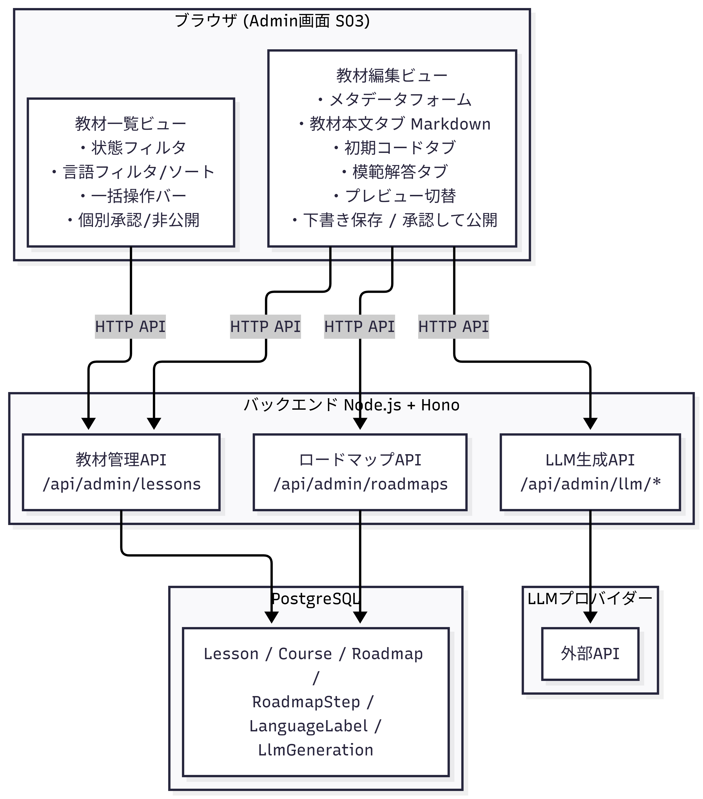

# 教材管理アーキテクチャ

## 1. 概要

教材管理コンテキストは、Admin画面を通じて教材のライフサイクル全体を管理する境界づけられたコンテキストである。

対象範囲は次の3つである。

- **教材作成**: 手動入力またはLLM生成による教材・ロードマップの下書き作成
- **編集・削除**: 教材本文・メタデータ・初期プロジェクト・参考プロジェクトの更新と削除
- **公開・非公開**: `draft` / `published` のステータス管理と一括操作

> **ユーザーの進捗管理について**
> 進捗保存・コード履歴・提出履歴はMVP対象外である。将来的にユーザー管理を導入した段階で別途設計する。

---

## 2. コンポーネント構成



### 主要集約

| 集約ルート | 主な責務 |
|-----------|---------|
| Lesson | 教材の本文・メタデータ・初期プロジェクト・ステータスを管理する |
| Course | 複数のLessonをグループとしてまとめる |
| Roadmap | LLMが生成したカリキュラムパスを管理する |
| RoadmapStep | Roadmapの各ステップとLessonの紐づけを管理する |
| LanguageLabel | 教材に付与できる言語/フレームワークラベルを管理する |
| LlmGeneration | LLM生成の入出力・ステータスを記録する |

### Lessonの主要属性

| 属性 | 説明 |
|------|------|
| `title` | 教材タイトル |
| `description` | 概要 |
| `level` | `beginner` / `intermediate` / `advanced` |
| `bodyMarkdown` | Markdown形式の教材本文 |
| `learningGoals` | 学習目標 |
| `initialProjectRef` | 初期プロジェクトの保存先参照 |
| `solutionProjectRef` | 参考プロジェクトの保存先参照 |
| `status` | `draft` / `published` |
| `courseId` | NULL許容。CourseなしでLessonを作成できる |
| `llmGenerationId` | NULL許容。LLM生成の場合に元のLlmGenerationを参照 |

---

## 3. 教材管理の流れ

### 3.1 教材作成

教材の作成経路は「手動作成」と「LLM生成」の2つである。どちらの場合も、Lessonは必ず`draft`状態で作成される。

#### 手動作成

```
Admin が [+ 教材を追加] を押す
  │
  ▼
教材編集ビューを開く（空の状態）
  │ 入力項目:
  │   タイトル、概要、対象レベル、学習目標
  │   教材本文 (Markdown)
  │   初期コード、模範解答
  │   言語ラベル（複数選択可）
  ▼
[下書き保存] または [承認して公開する]
  │
  ├── [下書き保存]       → POST /api/admin/lessons (status: draft)
  └── [承認して公開する] → POST /api/admin/lessons (status: published)
                            ※ 公開前にプレビュー確認を推奨
```

#### LLM生成によるロードマップ・教材作成

```
Admin が到達目標・成果物・対象レベルなどを入力
  │
  │ POST /api/admin/llm/roadmaps
  ▼
LlmGeneration レコード作成 (type: roadmap_generation, status: pending)
  │ 非同期でLLMプロバイダーAPIを呼び出し
  ▼
GET /api/admin/llm/generations/:generationId  ← ポーリング
  │ status: completed になったら output を取得
  ▼
Roadmap / RoadmapStep レコードを draft として保存
  │ RoadmapStep.lessonId は初期状態では NULL
  ▼
Admin が Roadmap・RoadmapStep の内容を確認・編集
  │ PUT /api/admin/roadmaps/:roadmapId
  │ PUT /api/admin/roadmaps/:roadmapId/steps/:stepId
  ▼
ステップごとに教材を生成
  │ POST /api/admin/llm/lessons
  ▼
LlmGeneration レコード作成 (type: lesson_generation, status: pending)
  │ 非同期でLLMプロバイダーAPIを呼び出し
  ▼
Lesson レコードを draft として保存
  │ llmGenerationId に元の LlmGeneration を設定
  │ RoadmapStep.lessonId に紐づけ
  ▼
Admin が Lesson の内容・コード・依存関係・著作権・誤情報を確認
  │
  ▼
問題なければ published へ変更（§3.3 参照）
```

#### LLM教材修正案の生成

```
Admin が既存の Lesson を選択
  │
  │ POST /api/admin/llm/lesson-revisions
  ▼
LlmGeneration レコード作成 (type: lesson_revision, status: pending)
  │ 非同期でLLMプロバイダーAPIを呼び出し
  ▼
GET /api/admin/llm/generations/:generationId  ← ポーリング
  │ status: completed になったら修正案を取得
  ▼
Admin が修正案を確認し、必要な箇所を手動で Lesson へ反映する
  ※ 修正案の自動反映は行わない
```

---

### 3.2 編集・削除

#### 個別編集

```
Admin が教材一覧から [編集] を押す
  │
  │ GET /api/admin/lessons/:lessonId
  ▼
教材編集ビューに現在の内容を表示
  │ 編集対象:
  │   タイトル、概要、難易度、学習目標
  │   教材本文 (bodyMarkdown)
  │   初期コード (initialProjectRef)
  │   模範解答 (solutionProjectRef)
  │   言語ラベル
  │   公開状態
  ▼
[下書き保存]
  │ PUT /api/admin/lessons/:lessonId
  │ published 中の教材を直接上書きするか、
  │ draft に戻してから公開するかは実装時に決定する
  ▼
保存完了
```

#### 個別削除

```
Admin が [削除] を押す
  │
  ▼
確認ダイアログを表示（破壊的操作のため必須）
  │
  │ 確認後
  │ DELETE /api/admin/lessons/:lessonId
  ▼
Lesson レコードを削除
  ※ MVPでは物理削除から開始してもよい
  ※ 外部公開・複数管理者運用の段階では論理削除へ移行する
```

#### 一括削除

```
Admin がチェックボックスで複数の Lesson を選択
  │
  ▼
一括操作バーから [削除する] を選択
  │
  ▼
確認ダイアログを表示（削除は警告を強調表示）
  │
  │ 確認後
  │ POST /api/admin/lessons/bulk/delete
  │   Body: { lessonIds: ["lesson_001", "lesson_002"] }
  ▼
選択した Lesson レコードをまとめて削除
```

---

### 3.3 公開・非公開

Lessonのステータスは `draft` と `published` の2値である。遷移は双方向に可能。

```
draft ──[承認]──▶ published
published ──[非公開]──▶ draft
```

#### 個別の公開・非公開

```
[承認] (draft → published):
  PUT /api/admin/lessons/:lessonId  { status: "published" }
  または教材編集ビューの [承認して公開する] ボタン

[非公開] (published → draft):
  PUT /api/admin/lessons/:lessonId  { status: "draft" }
  または教材一覧の [非公開] ボタン
```

#### 一括の公開・非公開

```
Admin がチェックボックスで複数の Lesson を選択
  │
  ▼
一括操作バーから操作を選択
  │
  ├── [承認して公開]: POST /api/admin/lessons/bulk/publish
  │                   Body: { lessonIds: [...] }
  │
  └── [非公開にする]: POST /api/admin/lessons/bulk/draft
                      Body: { lessonIds: [...] }
  ▼
確認ダイアログで確定 → 選択した全 Lesson のステータスを一括変更
```

#### 公開前の確認観点（ドメインルール）

LLM生成・手動作成を問わず、`published` にする前にAdminは次の観点を確認する。

| 観点 | 内容 |
|------|------|
| 教材内容の正確性 | 説明やコードが正しいか |
| コードの実行可否 | 初期プロジェクト・模範解答がビルドできるか |
| 依存関係の妥当性 | pubspec.yaml が適切か |
| 著作権 | 引用・参照に問題がないか |
| 誤情報 | 誤った情報が含まれていないか |
| セキュリティ | 危険なコードが含まれていないか |

---

## 4. データフロー

### 4.1 教材作成（手動）

```
Admin (ブラウザ)
  │
  │ POST /api/admin/lessons
  │   { title, description, level, bodyMarkdown, learningGoals,
  │     initialProject (files), solutionProject (files),
  │     languageLabelIds, status }
  ▼
backend
  │ Lesson レコードを PostgreSQL に保存
  │ initialProject / solutionProject を
  │   ローカルボリューム (MVP第一段階) または
  │   オブジェクトストレージ (MVP第二段階) に保存
  │   → initialProjectRef / solutionProjectRef に保存先パスを記録
  │ LessonLanguageLabel レコードを保存（複数ラベル分）
  ▼
{ lessonId, status: "draft" } を返す
```

### 4.2 LLM生成フロー

```
Admin (ブラウザ)
  │
  │ POST /api/admin/llm/roadmaps
  │   { goal, finalDeliverable, targetLevel, prerequisites, ... }
  ▼
backend
  │ LlmGeneration レコード作成
  │   (type: roadmap_generation, status: pending, input: {...})
  │ LLMプロバイダーAPIを呼び出し（非同期）
  │   渡す情報: 到達目標、成果物、レベル、前提知識、粒度指定
  │   送らない情報: 秘密情報、APIキー、DB接続情報、ホストパス
  ▼
LlmGeneration.status: completed, output: { roadmap, steps }
  │
  │ Roadmap レコード作成 (status: draft)
  │ RoadmapStep レコード作成 (lessonId: NULL)
  ▼
Admin がポーリングで完了を検知
  │ GET /api/admin/llm/generations/:generationId
  ▼
Admin が Roadmap / RoadmapStep を確認・編集後、教材を生成
  │ POST /api/admin/llm/lessons
  ▼
Lesson レコード作成 (status: draft, llmGenerationId: 参照先)
RoadmapStep.lessonId に紐づけ
```

### 4.3 公開状態変更

```
Admin (ブラウザ)
  │
  │ PUT /api/admin/lessons/:lessonId  { status: "published" }
  │   または POST /api/admin/lessons/bulk/publish { lessonIds: [...] }
  ▼
backend
  │ Lesson.status を published に変更
  │ updatedAt を更新
  ▼
学習者向け GET /api/lessons に当該 Lesson が表示される
```

### 4.4 削除

```
Admin (ブラウザ)
  │
  │ DELETE /api/admin/lessons/:lessonId
  │   または POST /api/admin/lessons/bulk/delete { lessonIds: [...] }
  ▼
backend
  │ LessonLanguageLabel レコードを削除（関連テーブルのクリア）
  │ Lesson レコードを削除（MVPは物理削除）
  ▼
{ ok: true } を返す
```

---

## 5. セキュリティ境界


### ドメインレベルのルール

| ルール | 内容 |
|-------|------|
| LLM生成は draft 必須 | LLM生成の Lesson / Roadmap は自動で published にしない |
| 修正案の自動反映禁止 | LLM lesson_revision の結果はAdminが手動で反映する |
| 削除は確認必須 | UIで確認ダイアログを表示する。一括削除は警告を強調 |
| 管理者API分離 | `/api/admin/*` は学習者向けAPIとは別の権限境界として扱う |

---

## 6. API構成

### 教材管理API

| メソッド | パス | 用途 |
|---------|-----|------|
| `GET` | `/api/admin/lessons` | 教材一覧取得（draft/published）。status・言語フィルタ・ソート対応 |
| `POST` | `/api/admin/lessons` | 教材作成 |
| `GET` | `/api/admin/lessons/:lessonId` | 教材詳細取得 |
| `PUT` | `/api/admin/lessons/:lessonId` | 教材更新（本文・メタデータ・status） |
| `DELETE` | `/api/admin/lessons/:lessonId` | 教材削除 |
| `POST` | `/api/admin/lessons/bulk/publish` | 複数教材を一括 published |
| `POST` | `/api/admin/lessons/bulk/draft` | 複数教材を一括 draft |
| `POST` | `/api/admin/lessons/bulk/delete` | 複数教材を一括削除 |

### 言語ラベルAPI

| メソッド | パス | 用途 |
|---------|-----|------|
| `GET` | `/api/admin/language-labels` | 言語ラベル一覧取得 |
| `POST` | `/api/admin/language-labels` | 言語ラベル作成 |

### ロードマップAPI

| メソッド | パス | 用途 |
|---------|-----|------|
| `GET` | `/api/admin/roadmaps` | ロードマップ一覧（draft/published） |
| `GET` | `/api/admin/roadmaps/:roadmapId` | ロードマップ詳細 |
| `PUT` | `/api/admin/roadmaps/:roadmapId` | ロードマップ編集（タイトル・目標・status） |
| `GET` | `/api/admin/roadmaps/:roadmapId/steps` | ステップ一覧 |
| `PUT` | `/api/admin/roadmaps/:roadmapId/steps/:stepId` | ステップ編集（lessonId紐づけ等） |

### LLM生成API

| メソッド | パス | 用途 |
|---------|-----|------|
| `POST` | `/api/admin/llm/roadmaps` | ロードマップ生成 |
| `POST` | `/api/admin/llm/lessons` | 教材生成 |
| `POST` | `/api/admin/llm/lesson-revisions` | 教材修正案生成 |
| `GET` | `/api/admin/llm/generations/:generationId` | 生成結果の取得（ポーリング） |

詳細は [API設計](../technology/03_API設計.md) を参照する。

---

## 7. 技術スタック対応

| コンポーネント | 採用技術 | 用途 |
|-------------|---------|------|
| Admin UI | Next.js + TypeScript + CSS Modules | S03 Admin画面の実装 |
| Markdownレンダリング | react-markdown 等 | 教材本文のプレビュー表示 |
| バックエンドAPI | Node.js + Hono + TypeScript | Admin API・LLM連携APIの実装 |
| ORM | Prisma | Lesson / Roadmap / LlmGeneration 等のDB操作 |
| データベース | PostgreSQL | 教材メタデータ・ロードマップ・LLM生成履歴の永続化 |
| プロジェクトストレージ | ローカルボリューム (第一段階) / S3 等 (第二段階) | initialProject / solutionProject の保存 |
| LLM | プロバイダーAPI（特定プロバイダーに依存しない） | ロードマップ生成・教材生成・修正案生成 |

詳細は [技術選定](../technology/01_技術選定.md) を参照する。
